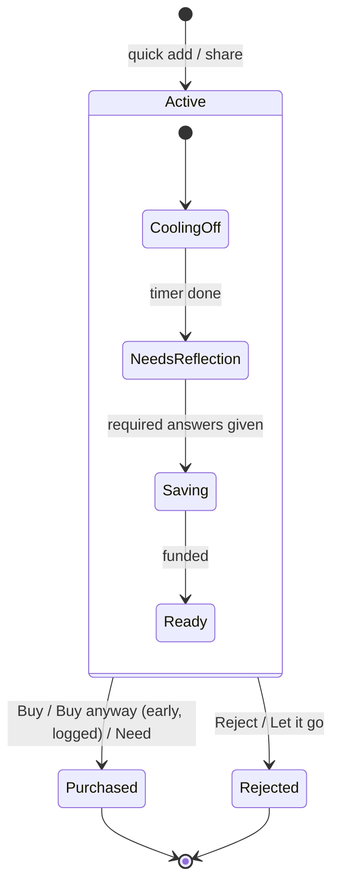

# Product brief

> Working name: **Before You Buy** (final name not decided — see "Open decisions").
> Status: planning complete for MVP, no code yet. Last updated: 2026-10-04.

## 1. One sentence

A source-available Android app that makes people **pause, reflect, prioritize and deliberately save** for purchases before they buy them.

## 2. Philosophy

> **Don't prevent people from buying things. Help them make sure the purchase is actually worth it.**

The app sits between *"I want this"* and *"I'm buying this"* and adds deliberate, kind friction.

The app **does**:

- make intentional purchases easier and impulse purchases slightly harder
- make opportunity cost visible ("what else could this money do?")
- make the user compare competing wants instead of evaluating each one in isolation
- help the user learn from their own past decisions

The app **does not**:

- prevent, shame or moralize spending
- optimize for spending as little as possible ("better spending, not maximum frugality")
- behave like a shopping platform, show deals, or encourage browsing
- connect to banks or move real money (all money in the app is an *earmark*, not an account)

It is **not primarily a budgeting app**. The budget exists only to support purchase decisions.

## 3. Target user

Someone who wants many (often expensive) things at the same time and can't reasonably afford all of them — e.g. "camera, 3D printer, bicycle upgrade". Two problems:

1. impulse purchases
2. too many competing wants

The question the app asks is not *"Can I afford this?"* but **"Is this the best use of my money compared with everything else I want?"**

Launch market: English + German UI, EUR default (any single currency selectable).

## 4. Core concepts

### 4.1 Item

Anything the user is considering buying.

| Field | Required | Notes |
|---|---|---|
| Name | yes | |
| Price | yes | Integer minor units + the app's currency |
| Link (URL) | no | Usually from the share sheet |
| Image | no | From photo picker; copied into app storage. **De-emphasized** while cooling off (see §6) |
| Category | no | Free text or simple list |
| Notes | no | |
| Kind | yes | `WANT` (default) or `NEED` (see 4.4) |
| Date added | auto | |
| Target purchase date | no | Informational only |
| Reflection answers | later | See 4.3 |
| Allocated savings | derived | Sum of allocations |
| Priority slot | no | 1..N if the item is an active priority |

### 4.2 Cooling-off period

Every `WANT` gets a waiting period based on its price. Defaults (user-configurable in Settings):

| Price | Waiting period |
|---:|---:|
| < 100 | 7 days |
| 100 – < 500 | 30 days |
| 500 – < 1,000 | 60 days |
| ≥ 1,000 | 90 days |

Rules:

- The cooling-off end is fixed when the item is added: `coolingEndsAt = addedAt + period(price)`.
- **Editing the price can only extend, never shorten** the period: `coolingEndsAt = max(current, addedAt + period(newPrice))`. (Prevents gaming by entering a low price first.)
- Changing the tier settings affects new items only.
- *"Wanting something immediately does not make it immediately purchasable."*

### 4.3 Reflection

Capture must be fast (name + price, ~10 seconds). Reflection happens **after** capture: the app nudges the user to answer within the first days, and an item **cannot become Ready until the required questions are answered.**

Questions (research: listing reasons *for and against* reduces impulse urge — see `research.md`):

| Question | Required for Ready |
|---|---|
| Why do you want this? | yes |
| How often will you use it? (picker: daily / weekly / monthly / rarely / once) | yes |
| Reasons **against** buying it | yes (at least one) |
| What problem does it solve? | no |
| What do you use now instead? | no |
| What will it replace? | no |
| Why now? | no |
| Upgrade or genuinely new? | no |

Answers are shown again on the decision screen — this creates the separation between *initial excitement* and *final decision*.

### 4.4 Need fast path

A user can mark an item as `NEED` (e.g. "fridge broke"). A need:

- skips the cooling-off period and reflection requirement
- goes straight to the decision screen
- is recorded in history as a need (so the user can later see whether "needs" were really needs)
- is **not** drawn from the discretionary pool by default (it's a necessity), but can be if the user chooses

Without this path users stop using the app for "real" purchases.

### 4.5 Discretionary pool (monthly allowance)

Manual, no bank connection.

- The user sets a **monthly allowance** (e.g. 300 €) and an accrual day (default: 1st).
- The pool grows automatically each month — no upkeep required. Optional starting balance and manual adjustments (+/−) with a note.
- `pool = startingBalance + accruals + adjustments − spentFromPool`
- `committed = sum of allocations to active items`
- `unallocated = pool − committed` (shown prominently; may never go below zero through allocation)

Example: *300 € available · 200 € committed to wishlist · 100 € unallocated*.

### 4.6 Savings per item (earmarks)

Any active item can receive allocations from the unallocated pool ("put 100 € toward the camera"). Saving can start **on day 1, in parallel with cooling off.**

- Allocation is limited by `unallocated`.
- Reject → allocations return to unallocated.
- Buy → allocations are consumed; if the actual price differs, the difference is taken from / returned to unallocated (user confirms).

### 4.7 Priorities

- **N active priority slots**, configurable 1–5, **default 3**.
- If a free slot exists, an item can simply be promoted.
- If all slots are full, the new item must **earn its place via head-to-head comparison**: the app shows the new item next to each current priority (price, reasons, usage, saved amount) and asks *"Which would you rather have?"*. Losing items move back to the general wishlist; ranks are updated by the outcomes.
- Rationale: joint (side-by-side) evaluation leads to more considered choices than evaluating each item alone (see `research.md`).

## 5. Lifecycle

The original linear idea (*Idea → Cooling Off → Considered → Saving → Ready → Purchased/Rejected*) was revised: **waiting and saving run in parallel.**

An active item has three independent conditions:

- `cooledOff` — now ≥ `coolingEndsAt` (always true for `NEED`)
- `reflected` — required reflection answers present (always true for `NEED`)
- `funded` — allocations ≥ price

The **displayed stage** is derived, never stored:

| Stage | Condition |
|---|---|
| Cooling off | not cooledOff |
| Needs reflection | cooledOff, not reflected |
| Saving | cooledOff, reflected, not funded |
| **Ready** | cooledOff, reflected, funded |

Terminal statuses (stored): `PURCHASED`, `REJECTED` (= "Decided against").

Allocations and reflection answers can happen at any time while an item is active, so an item may go straight from *Cooling off* to *Ready* the moment its timer ends. *Wait* keeps the item active with a re-check date.

Decisions:

- **Buy** — available when Ready (or for `NEED`). Records actual price and date.
- **Buy anyway (early)** — available any time but behind deliberate friction: type a reason, see the opportunity cost, confirm. Logged as `earlyPurchase = true` and visible in history/stats. (Soft lock, chosen 2026-10-04.)
- **Wait** — sets a re-check date (e.g. 7 / 30 days); item stays active.
- **Reject / Let it go** — moves to "Decided against". Never deleted (user may delete explicitly).

## 6. Screens (MVP)

### 6.1 Home / dashboard — answers four questions

1. **What am I considering?** — priorities + wishlist count
2. **What can I decide on?** — Ready items (and items whose cooling-off just ended)
3. **What am I saving for?** — priority goals with progress
4. **How much discretionary money do I have?** — available / committed / unallocated

The "decided against" total is **not** shown next to Ready items (moral licensing — see `research.md`).

### 6.2 Quick add

Bottom sheet: name + price (+ optional link, kind = want/need). Saving takes ≤ 10 seconds. Opens prefilled from the share sheet.

### 6.3 Wishlist & item detail

List grouped by stage. Item detail leads with **the user's own reasons and the countdown**, not the product photo (image small/collapsed while cooling off). There is **no prominent "open in shop" button** while cooling off — browsing during a delay defeats it (research). The link is still accessible (e.g. overflow menu / copy link).

### 6.4 Reflection

Short, one question per step, skippable except required ones. "Reasons against" is a list the user can add to.

### 6.5 Decision screen

Shows: price · how long they've wanted it · cooling-off completed (or how much is left, for early) · amount saved · original reasons (for & against) · expected usage · what it replaces · other priorities · effect on the discretionary pool · **opportunity cost**.

Then asks: **"Do you still want to spend this money on this?"** — Buy / Wait / Reject, with Reject visually equal to Buy.

The not-buying option is labelled concretely, e.g. *"Keep 1,200 € for your Camera (#2)"* (research: describing the alternative reduces impulse purchases).

### 6.6 History

Two tabs: **Bought** and **Decided against**.

- Bought: price, date, original price, time considered, original reason, early/need flag.
- Decided against: total shown as *"You decided against 3,420 € of purchases"* — neutral, no trophies, streaks, confetti or "you saved!" language.

### 6.7 Settings

Currency · monthly allowance & accrual day · starting balance / adjustments · cooling-off tiers · priority slots · notifications · export/import · language (follows system, per-app language supported).

## 7. Opportunity cost

Shown on the decision screen and item detail. Computed in the pure domain layer. Examples for a 1,200 € item:

- *= 75 % of your Bike upgrade goal*
- *= 4 months of your discretionary allowance*
- *Buying this delays your #2 priority by ~3 months* (based on allowance rate)
- *= your 3 smallest wishlist items combined*

MVP shows the simplest two (months of allowance, other priorities); the rest follows in M2.

## 8. Notifications

Encourage reflection, never consumption. A daily background check (WorkManager), at most one digest-style notification per day.

Allowed:

- *"You've wanted the camera for 61 days. Your cooling-off period is over."* — actions: **Still want it** / **Let it go**
- *"Take 1 minute to note why you want the 3D printer."* (reflection nudge, ~day 2)
- *"You decided against 430 € of purchases this month."* (monthly, opt-in)

Never:

- *"You have money available!"*, deal/price alerts, product suggestions, anything that resembles a shop.

The explicit "Let it go" action is deliberate: in the *one sec* study the option to dismiss was the most effective element.

## 9. Privacy & data

- Local only, no account, no server, no analytics, no ads.
- **MVP ships without the `INTERNET` permission.** Shared links are parsed offline (title + URL from the share text). This enables the store claim *"This app cannot send your data anywhere."* CI enforces it.
- Backup: export/import a versioned JSON file + Android Auto Backup / device-transfer rules.

## 10. Scope & milestones

| Milestone | Goal | Content |
|---|---|---|
| **M0 Foundation** | A buildable, tested, CI-checked empty app | Cloud env/SDK, project scaffold, CI, theme & i18n |
| **M1 Core loop** | Usable for the creator's own purchases | Domain model, cooling-off engine, persistence, quick add, share capture, wishlist/detail, reflection, decision screen (basic opportunity cost), history, notifications, dashboard |
| **M2 Money & priorities** | The differentiators | Allowance pool, per-item savings & Ready, priorities + head-to-head, full opportunity cost |
| **M3 Release** | Google Play closed test → production | Settings, export/import, onboarding, German copy, accessibility, privacy policy, name/ID/account decisions, store listing & release pipeline |
| **Later** | v1.x | Home-screen widget, "Was it worth it?" check-in & insights, opt-in link previews, cost in hours worked, monetization |

Capture methods: share sheet + manual quick add (M1), home-screen widget (Later).

## 11. Decision log

| Date | Decision |
|---|---|
| 2026-10-04 | Android only, native Kotlin + Jetpack Compose |
| 2026-10-04 | Code is written mostly by Claude sessions → issues are self-contained specs |
| 2026-10-04 | Monetization: free for now, decide later |
| 2026-10-04 | Data: local only + export; no account, no bank connection |
| 2026-10-04 | Cooling-off: soft lock with friction; early purchases logged |
| 2026-10-04 | Waiting and saving run in parallel; Ready = cooled + reflected + funded |
| 2026-10-04 | `NEED` fast path skips cooling-off, still logged |
| 2026-10-04 | "Decided against" stat shown carefully (no trophies/streaks) |
| 2026-10-04 | Product images de-emphasized during cooling-off |
| 2026-10-04 | Discretionary money = monthly allowance that accrues automatically |
| 2026-10-04 | Reflection asked after capture; required before Ready |
| 2026-10-04 | Languages: English + German |
| 2026-10-04 | Capture: share sheet + quick add (MVP), widget later; no app interception |
| 2026-10-04 | Priorities: configurable 1–5, default 3; head-to-head to earn a slot |
| 2026-10-04 | Licence: PolyForm Noncommercial 1.0.0 (forks allowed, must stay non-commercial); brand reserved separately (`TRADEMARKS.md`) |
| 2026-10-04 | No outside code contributions for now (no CLA needed); issues/ideas welcome |

## 12. Open decisions

- **Final app name and logo** — #31 (descriptive names are hard to register as EU word marks — see `research.md`)
- **applicationId** — #33 — placeholder during development; must be final before the first Play upload (it can never change)
- **Google Play account type** — #34 — personal (12 testers × 14 days closed test) vs organization (D-U-N-S, exempt)
- **Monetization model** — #41 — and with it EU DSA trader status (public address) and German business registration
